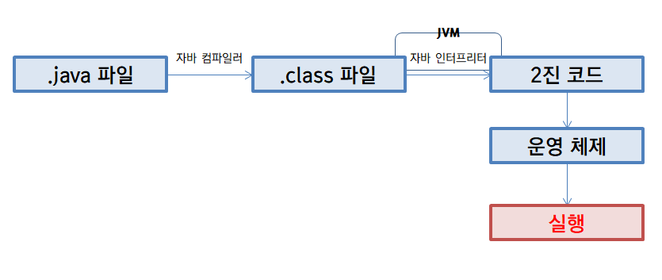
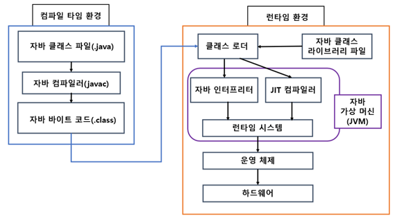
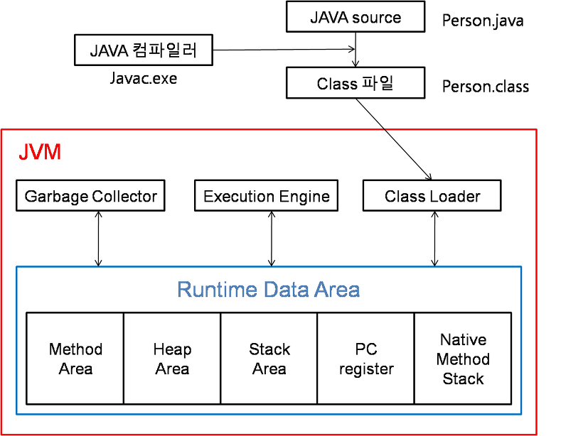
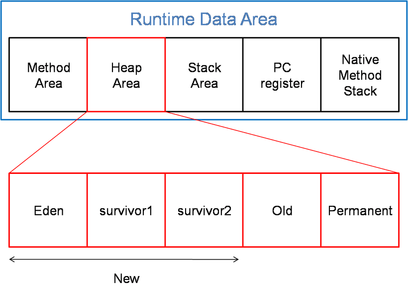
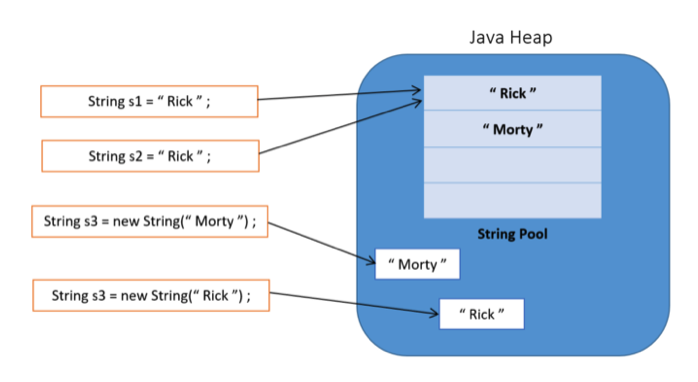
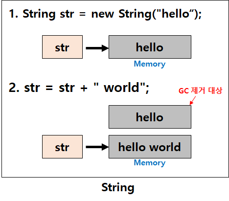
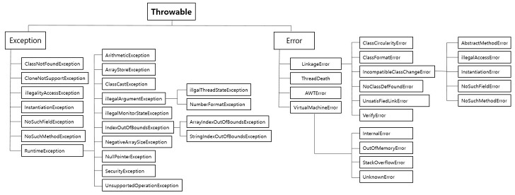

### Java 의 특징

- 객체지향적 프로그래밍 언어
    - 순차적으로 처리되는 절차지향 언어와는 달리, **객체를 생성하여 여러 객체들을 결합하여 하나의 프로그램을 구현**하는 것이다.
    - 절차지향 언어는 하나의 기능을 수행하기 위해 여러 코드들이 미리 정의된 순서대로 유기적으로 연결되어 있기 때문에 유지보수가 어렵다.
    - 절차지향 언어는 컴퓨터가 처리하는 과정과 동일하게 구성되어 있기 때문에 처리 속도가 빠르다.
    - 객체지향 언어는 특정 기능을 하는 집단을 객체로 선언해두었기 때문에 프로그램을 구조적으로 이해하기 쉽다.
    - 객체지향 언어는 모든 기능들을 객체로 생성 후 연결해주어야 하기 때문에 절차지향 언어보다 처리 속도가 늦다.
- 인터프리터 언어
    - 자바는 **컴파일 언어인 동시에 인터프리터 언어**이다. (하이브리드 언어)
        - 컴파일 언어 : 코드가 실행되기 전 컴파일러를 거쳐서 기계어로 모두 변환되어 실행 (C, C++, Go 등)
        - 인터프리터 언어 : 프로그래밍 언어의 소스 코드를 바로 실행 (Python, Javascript 등)
    - .java 파일을 컴파일하여 .class 파일로 생성 후 런타임 시 클래스 파일을 인터프리터 형식으로 실행된다.
    - 처음에는 인터프리터 형식을 사용하다가, 성능 향상을 위해 컴파일 과정이 추가되었다.
  

- 독립적인 플랫폼
    - **운영체제에 독립적인 프로그램 구현**이 가능하다.
    - 자바 언어로 구성된 소스 코드를 JVM 이 적절하게 운영체제에 맞춰 동작한다.
    - 하지만 JVM 은 각 운영체제에 맞는 버전을 사용해야 하며, JVM 위에서 동작하기 때문에 다른 언어보다 속도가 느리다는 단점이 있다.
- 자동 메모리 관리
    - 개발자가 직접 메모리를 관리하는 C언어와는 달리 자바가 직접 메모리를 관리하여 편리하다.
    - 객체 생성 시 자동적으로 메모리 영역에 할당되며 사용되지 않는 객체를 GC 가 직접 제거해준다.
- 멀티 쓰레딩 지원
    - 하나의 프로그램 위에서 동일한 쓰레드를 여러개 동작시킬 수 있다.
    - 운영체제마다 멀티 쓰레드를 구현하는 API 가 다르나, 자바의 경우 자바 라이브러리를 제공하기 때문에 사용하기 떄문에 간편하다.
- 동적 로딩 지원
    - 프로그램 실행 시 모든 객체를 메모리에 할당하는 것이 아닌 런타임 시 필요한 객체만을 할당한다.
    - 필요할 경우에만 할당하기 때문에 메모리를 효율적으로 사용할 수 있다.
    - 필요할 때마다 할당 후 사용해야 하기 때문에 비교적 속도가 느리다는 단점이 있다.

### 객체지향 프로그래밍의 4가지 특징 (OOP: Object-Oriented Programming)
- 추상화(Abstraction)
    - 공통의 속성과 기능을 추출하여 정의하는 것(추상 클래스, 인터페이스)
    - 유연하고 변경에 열려있는 프로그램을 설계하기 위해 역할과 구현을 분리하여 관리함
- 상속(Inheritance)
    - 기존의 클래스를 재활용하여 새로운 클래스를 생성하는 것(변수와 메서드)
    - 공통적인 부분을 재사용함으로써 반복적인 코드 최소화
    - 추상화의 경우 구현되지 않는 부분을 모두 구현해야 사용할 수 있지만, 상속은 그대로 사용하거나 일부만 오버라이딩하여 사용할 수 있다
- 다형성(Polymorphism)
    - **어떤 객체의 속성이나 기능이 상황에 따라 여러 가지 형태를 가질 수 있는 성질**
    - 다형성을 이용하면 상속 및 인터페이스를 구현한 객체들을 하나의 타입으로 다룰 수 있다
    - 오버라이딩(Overriding) : 구현되어 있는 메서드를 현재 클래스에 맞게 구현부를 변경하는 것
        - 같은 이름의 메서드가 상황에 따라 다른 기능을 수행함
    - 오버로딩(Overloading) : 동일한 클래스 내에서 매개변수의 특징(개수, 타입)이 다른 동일한 메서드명을 사용하여 다른 기능을 구현하는 것
        - 같은 이름의 메서드가 매개변수에 따라 다른 기능을 수행함
- 캡슐화(Encapsulation, Information Hiding)
    - 서로 연관되어 있는 속성과 기능을 하나의 캡슐로 선언하여 데이터를 외부로부터 보호하는 것
    - 접근 제어자를 통해 외부에 노출되고 싶은 부분을 선택적으로 정의

| 접근 제어자    | 클래스 내 | 패키지 내 | 다른 패키지의 하위 클래스 | 패키지 외 | 설명                              |
|-----------|-------|-------|----------------|-------|---------------------------------|
| private   | O     | X     | X              | X     | 동일 클래스 내에서만 접근 가능               |
| default   | O     | O     | X              | X     | 동일 패키지 내에서만 접근 가능               |
| protected | O     | O     | O              | X     | 동일 패키지 + 다른 패키지의 하위 클래스에서 접근 가능 |
| public    | O     | O     | O              | O     | 접근 제한 없음                        |

### 객체지향 설계의 5원칙
- **SRP(Single Responsibility Principle) : 단일 책임 원칙**
    - 객체는 하나의 책임만을 가져야 한다. ← 요구사항 변경 시 수정 최소화
- **OCP(Open Closed Principle) : 개방 폐쇄 법칙**
    - 확장에는 열려있고, 변화에는 닫혀있어야 한다.
    - 기능 확장 시 기존의 코드는 변경하지 않으면서 기능을 추가할 수 있도록 설계해야 한다.
    - 예시) Java 에서는 JDBC 로 추상화하여 또 다른 DB 접근 구현 객체가 늘어나더라도 추상화된 JDBC 를 사용하는 주체에게는 영향이 없다.
- **LSP(Listov Substitution Principle) : 리스코프 치환 원칙**
    - 자식 클래스는 언제나 부모 클래스로 변경할 수 있어야 한다.
    - 추상화를 위해 인터페이스로 분리하였으나 자식 클래스에서만 사용하는 클래스를 선언하여 부모 클래스로 대체하지 못하는 경우 리스코프 치환 원칙을 위배하는 것이다.
- **ISP(Interface Segregation Principle): 인터페이스 분리 원칙**
    - 인터페이스를 설계할 때 여러 기능을 모두 수행하는 슈퍼 인터페이스가 아닌 세부적으로 분리한다. (역할 최소화)
    - 인터페이스 구현 시 사용하지 않는 기능에 대한 정의를 하지 않아야 한다.
- **DIP(Dependency Inversion Principle): 의존 역전 원칙**
    - 의존 관계를 맺을 때 자주 변경되는 것보다 변화가 적은 것과 의존해야 한다.
    - 구체적인 클래스보다 추상 클래스나 인터페이스를 사용한다.
- 참고 사이트
    - [https://hckcksrl.medium.com/solid-원칙-182f04d0d2b](https://hckcksrl.medium.com/solid-%EC%9B%90%EC%B9%99-182f04d0d2b)

### 자바 프로그램 동작 과정

자바 어플리케이션을 구동시키는 데 다음과 같은 과정을 거친다. 자바 어플리케이션을 실행하면, JVM 은 OS 로부터 이 프로그램이 필요로하는 메모리를 할당받는다. 할당받은 메모리 영역을 JVM 이 용도에 따라 여러 영역으로 나누어 관리한다. 그 후 개발자가 작성한 자바 파일을 자바 컴파일러가 자바 바이트 코드로 이루어진 클래스 파일로 컴파일한다. 컴파일된 클래스 파일을 JVM 의 Class Loader 가 메모리에 할당하여 프로그램을 실행하는데 사용한다. 할당된 클래스 파일들은 JVM 의 Execution Engine 을 통해 해석된다.



메모리에 할당된 클래스 파일은 바이트 코드로 이루어져 있다. 바이트 코드란, **JVM 이 해석하기 위한 언어**로 0 과 1 로 구성되어있지만 CPU 는 해석할 수 없다. JVM 을 거쳐서 실제 동작을 하기 위해서는 CPU 가 이해할 수 있는 기계어(네이티브 코드)로 해석해야 하는데, 이 과정을 Interpreter 와 JIT Compiler 가 수행한다.

극 초기의 Java 는 Interpreter 만을 이용하여 클래스 파일을 실행하였다. `Interpreter`  는 **바이트 코드 명령어를 하나씩 읽어 그때그때 네이티브 코드로 해석하여 실행한다.** 하지만 동일한 프로그램에서 매번 실행되는 영역이 중복되기 때문에 이는 매우 비효율적인 방식이다. 이후에 Java 1.1 에서 Interpreter 를 보완한 JIT Compiler 가 도입되었다.

`JIT Compiler` 는 Just-In-Time Compiler 로 Interpreter 의 단점을 보완한다. **동일한 코드를 해석하는 과정이 반복되어, 자바 프로그램이 구동되고 자주 실행되는 영역에 한해 미리 네이티브 코드로 해석해둔다.** 네이티브 코드로 해석되어 있는 부분은 나중에 Interperter 가 실행될 때 해석하지 않고 바로 네이티브 코드를 사용하여 실행한다.

그러면 바로 네이티브 코드로 해석하지 않을까? JIT Compiler 는 자주 사용되는 영역을 한번에 해석하므로 바로 실행하는 부분만 해석하여 사용하는 Interpreter 보다 속도가 느리다. 따라서 Interpreter 로 실행은 하되, 더욱 빠른 해석을 위해 JIT Compiler 가 미리 해석해두는 과정으로 처리된다.

- 참고 사이트
    - [https://www.nowwatersblog.com/cs/JVM](https://www.nowwatersblog.com/cs/JVM)
    - [https://catsbi.oopy.io/df0df290-9188-45c1-b056-b8fe032d88ca](https://catsbi.oopy.io/df0df290-9188-45c1-b056-b8fe032d88ca)
    - [https://shrtorznzl.tistory.com/82](https://shrtorznzl.tistory.com/82)

### JVM(Java Virtual Machine) 의 구조

#### JVM 의 구조



JVM 은 컴파일된 .class 파일을 이용하여 자바 어플리케이션을 ‘실행’ 한다.

- **Class Loader** : 자바 컴파일러에 의해 컴파일된 클래스 파일을 JVM 의 Runtime Data Area 에 적재시킨다.
- **Runtime Data Area** : JVM 의 메모리 영역으로 자바 어플리케이션 실행 시 사용한다.
- **Execution Engine** : 클래스 로더에 의해 메모리에 할당된 클래스 파일(바이트 코드) 를 기계어(네이티브 코드) 로 해석하여 CPU 에 할당한다. (실행한다)
    - Interpreter
    - JIT Compiler
- **Garbage Collector** : 자바 어플리케이션의 메모리를 관리한다.

#### Runtime Data Area



JVM 의 메모리 영역은 역할에 따라 분리되어 있다.

- **Method Area(Static Area)** : 클래스 메타 정보 저장 (클래스의 메서드, 멤버 변수의 이름과 타입, 메서드의 이름과 파리미터, 리턴값, 상수, static 메서드, final 클래스 변수 등)
    - JVM 동작 시 클래스가 로딩될 때 생성
- **Heap Area** : new 키워드로 생성되는 클래스와 배열 저장
    - Method Area 에 저장된 클래스의 인스턴스만을 생성할 수 있으며 GC 의 관리를 받는다.
    - 런타임 시 할당
- **Stack Area** : 실행되는 메서드의 정보가 스택 형식으로 저장 (지역 변수, 파라미터, 리턴값, 연산에 사용되는 임시값 등)
    - 컴파일 시 할당
- **PC register** : 멀티 스레드 환경에서, 스레드가 생성될 때마다 생성되며 현재 실행중인 주소와 명령을 저장
- **Native Method Stack** : 자바 이외의 코드로 작성된 네이티브 코드를 위한 영역 (C/C++)
- 참고 사이트
    - [https://www.skyer9.pe.kr/wordpress/?p=280](https://www.skyer9.pe.kr/wordpress/?p=280)

### Java 의 원시 타입과 참조 타입

자바에서는 데이터를 다루기 위해 두 가지의 타입을 제공한다. 자바에서 일반적으로 사용하는 객체를 ‘참조 타입(reference type)’ 이라고 하며 객체가 아닌 순수 데이터를 ‘원시 타입(primitive type)’ 이라고 한다.

| 구분    | 원시형 타입  | 크기              | Wrapper Class | 크기       |
|-------|---------|-----------------|---------------|----------|
| 문자열   | char    | 2 Byte(16 bits) | Character     | 128 bits |
| 정수형   | byte    | 1 Byte(8 bits)  | Byte          | 128 bits |
|       | short   | 2 Byte(16 bits) | Short         | 128 bits |
|       | int     | 4 Byte(32 bits) | Integer       | 128 bits |
|       | long    | 8 Byte(64 bits) | Long          | 192 bits |
| 부동소수점 | float   | 4 Byte(32 bits) | Float         | 128 bits |
|       | double  | 8 Byte(64 bits) | Double        | 192 bits |
| 논리형   | boolean | 1 Byte(8 bits)  | Boolean       | 128 bits |

개발자가 직접 객체를 생성해서 사용하는 것 외에, 자바에서 기본적으로 제공하는 타입의 정보는 다음과 같다. 모든 원시 타입에 대응되는 참조 타입(wrapper class) 가 존재한다. 그러면 데이터를 다룰 때 원시 타입을 사용해야 할까, 참조 타입을 사용해야 할까?

- 원시 타입
    - null 을 저장할 수 없다.
    - Generic 을 사용할 수 없다.
    - 비교적 적은 메모리 영역을 사용한다.
    - Stack Area 에 저장되어 접근이 빠르다.
- 참조 타입
    - null 을 저장할 수 있다.
    - Generic 을 사용할 수 있다.
    - 비교적 더 많은 메모리 영역을 사용한다.
    - Heap Area 에 저장되어 접근이 느리며 GC 의 관리를 받는다.

### try-with-resources 란?

자바에서 외부 자원에 접근하는 경우 동시성 문제를 일으키지 않기 위해 자원에 대해 open 한 스레드가 해당 자원에 대해 권한을 가지며, 사용을 마칠 경우 close 를 통해 자원을 닫아 다른 스레드가 접근할 수 있도록 설정해야 한다.

외부 자원을 사용하고 ‘필수적으로’ close 를 해주어야 하기 때문에 일반적으로 try-catch-finally 구문을 이용하여 에러 핸들링 및 finally 구문에 close 를 해준다. 하지만 try-catch-finally 는 finally 부분에 close 를 하는 과정이 매번 반복되어 JDK7 에서는 이를 보완한 `try-with-resources` 가 추가되었다.

try (…) 안에 선언한 외부 자원을 open 하며 별도로 close 를 하지 않아도 자동으로 close 해준다. 이는 AutoCloseable 의 구현체일 경우에 해당된다. AutoCloseable 또한 JDK7 에서 추가되었다.

- 참고 사이트
    - [https://dev-coco.tistory.com/20](https://dev-coco.tistory.com/20)

### new String vs “”

자바에서 문자열은 기본적으로 불변이며 Thread-Safe 하다. 불변의 속성을 이용하여 중복적으로 선언되는 문자열을 JVM 자체에서 중복되지 않도록 관리하여 성능을 높였다. String 이 별도로 저장되는 영역을 **String Constant Pool** 이라고 한다.



String 이라는 클래스의 인스턴스가 생성되는 것이므로 JVM 의 Heap Area 에 저장된다. 하지만 동일한 문자열을 여러 개의 참조 변수에 할당한다면 실제로 저장되는 문자열은 하나만 저장된다.

예를 들어, String 타입 변수 s1 과 s2 를 모두 “Rick” 으로 선언하면 Heap Area 에 실제 “Rick” 의 값이 하나만 저장되며, s1 과 s2 는 Stack Area 에 저장되어 Heap Area 의 “Rick” 이 저장된 메모리의 주소가 저장된다. **동일한 문자열에 대해 캐싱하여 메모리의 영역을 효율적으로 사용하였다.**

하지만, String 을 선언하는 방법에 따라 String Constant Pool 에 저장되지 않을 수도 있다. 바로 new 키워드를 이용하는 것인데, new 키워드 이용 시 ‘새로운’ 인스턴스를 생성한다는 의미로 해석되어 일반 Heap Area 에 저장된다. 즉, 별도의 상수 영역이 아닌 일반 인스턴스 영역에 저장되기 때문에 동일한 문자열에 대한 처리가 없어 중복적인 문자열이 저장될 수 있다.

- 참고 사이트
    - [https://wonit.tistory.com/588](https://wonit.tistory.com/588)

### String, StringBuffer, StringBuilder 의 차이

자바에서 문자열을 다루는 클래스는 **String, StringBuffer, StringBuilder** 총 3가지가 있다. 가장 많이 사용하는 **String 클래스는 ‘불변’** 의 속성 덕분에 JVM 의 Heap Area 에서 별도로 관리(캐싱)하여 메모리를 절약한다는 이점이 있다. 하지만 문자열에 대한 연산이 많을 경우 오히려 불변 속성 때문에 Heap Area 에 수많은 문자열 데이터가 쌓여 GC 의 동작을 가속하는 문제가 발생할 수 있다.



이러한 경우에 가변 속성을 가지는 StringBuffer 와 StringBuilder 를 사용한다. 그렇다면 StringBuffer 와 StringBuilder 의 차이점은 무엇일까? 둘의 차이점은 동기화의 유무이다. **StringBuffer 는 멀티 쓰레드 환경에서 Thread-Safe 하며, StringBuilder 는 동기화를 지원하지 않아 단일 쓰레드 환경에서 성능 상의 이점이 있다.**

단순하게 멀티 쓰레드 환경만을 지원한다고 무조건 StringBuffer 를 사용하는 것이 아니라, 각 상황에 맞춰 적절한 타입을 선택하는 것이 중요하다. 객체 내에서 공유하는 자원일 경우 약간의 성능을 포기하더라도 동시성 문제가 발생하지 않도록 StringBuffer 를 선택하고, 메서드 내에서 단순 문자열을 더하기 위해 가변 지역 변수가 필요하다면 다른 쓰레드와 공유하는 환경이 아니므로 StringBuilder 를 사용하여 성능의 이점을 확보하자.

|              | String               | StringBuffer | StringBuilder |
|--------------|----------------------|--------------|---------------|
| 메모리 저장 위치    | String Constant Pool | Heap         | Heap          |
| 수정 여부        | 불가능                  | 가능           | 가능            |
| Thread-Safe  | O                    | O            | X             |
| Synchronized | O                    | O            | N             |
| 성능           | 좋음                   | 좋지 않음        | 좋음            |
- 참고 사이트
    - [https://ifuwanna.tistory.com/221](https://ifuwanna.tistory.com/221)

### 접근 제한자

변수 또는 메서드의 접근 범위를 설정하기 위한 키워드이다.

- public : 접근 제한 없음 (같은 프로젝트 내 어디서든 사용 가능)
- protected : 해당 패키지 내, 다른 패키지에서 상속받은 자식 클래스에서 접근 가능
- default : 해당 패키지에서만 접근 가능
- private : 해당 클래스에서만 접근 가능

### static

static 키워드를 사용한 변수나 메서드는 클래스가 JVM 의 Method Area(Static Area) 에 적재될 때 같이 생성되며 클래스 로딩이 끝나면 바로 사용할 수 있다. 모든 객체가 메모리에 접근할 수 있는 값이며, **GC 가 관리하지 않아 프로그램이 종료될 때까지 남아있어 유의하여 사용해야 한다.**

### 클래스 초기화 순서

- JVM 이 동작하여 클래스 로더가 JVM 의 Method Area 에 클래스를 로드할 때
    1. 클래스 변수의 기본값 (ex. **static** int num; → 0 으로 초기화)
    2. 클래스 변수의 명시적 초기화 (ex. **static** int num = 10;)
    3. 클래스 초기화 블럭 (ex. **static** { num = 20;})
- 인스턴스를 생성하여 JVM 의 Heap Area 에 저장될 때
    1. 인스턴스 변수의 기본값 (ex. String title; → null 로 초기화)
    2. 인스턴스 변수의 명시적 초기화 (ex. String title = “제목”;)
    3. 인스턴스 초기화 블럭 (ex. { title = “제목2”; })
    4. 인스턴스 생성자 (ex. ClassName(String title) {this.title = title})

### Reflection

JVM 은 클래스를 메모리에 할당할 때 Method Area(Static Area) 에 생성자, 메서드, 필드 등 클래스에 대한 정보를 저장한다. 이는 보통 객체를 생성할 때 해당 정보를 읽어와 인스턴스로 만든 후 Heap Area 에 저장하는 용도로 사용하지만, 개발을 하다보면 이러한 메타 정보가 필요한 경우가 발생한다. 이 때 **Reflection 을 이용하여 접근 제어자와 관계 없이 클래스의 메타 정보에 접근할 수 있다.**

일반적으로 메서드를 호출한다면 컴파일 시점에 분석된 클래스를 사용하지만, 리플렉션은 런타임에 클래스를 분석하므로 속도가 느리다. 런타임 시에 비로소 클래스의 타입을 알 수 있기 때문에 컴파일 시 타입 체크 또한 불가능하다. 이러한 단점 때문에 **일반적인 개발에는 사용하지 않고, 보통 IDE(ex. 자동완성 기능) 나 프레임워크(ex. 어노테이션) 에서 편의성을 위해 사용한다.**

- 참고 사이트
    - [https://hudi.blog/java-reflection/](https://hudi.blog/java-reflection/)

### Error vs Exception



- Error : 자바 어플리케이션 실행 중 발생할 수 있는 치명적인 오류이다. 컴파일 시점에 체크할 수 없고, 오류가 발생하면 프로그램은 비정상적으로 종료된다. 예측이 불가능한 UncheckedException 에 속한다.
    - ex. OutOfMemoryError, StackOverFlowError
- Exception : Error 보다는 비교적 경미한 오류이며, try-catch 구문을 이용하여 처리할 수 있다.
    - **CheckedException** : 컴파일 시 발생하는 예외
        - 필수적으로 예외 처리를 해주어야 하며, 예외 처리를 하지 않으면 컴파일되지 않는다.
        - RuntimeException 을 제외한 모든 예외
        - ex. IOException, SQLException
    - **UncheckedException** : 런타임 시 발생하는 예외
        - 컴파일 시에 처리되지 않고 실제 운영중일 때 발생한다.
        - ex. NullPointException, IndexOutOfBoundException
- 참고 사이트
    - [https://gyoogle.dev/blog/computer-language/Java/Error & Exception.html](https://gyoogle.dev/blog/computer-language/Java/Error%20&%20Exception.html)

### Optional

자바8에서 추가된 기능이다. **Optional 이란 객체 안에 담긴 값이 존재하지 않는 경우도 있을 경우에 사용한다.** 예를 들어 DB 에 있는 값을 조회할 떄 값이 존재하지 않을 가능성이 있을 수도 있으므로 Optional 을 사용할 수 있다. 값이 존재하지 않을 경우 런타임 시에 NPE 가 발생할 수 있는데, 이를 예방해준다.

Optional 객체 안에 저장된 값을 조회할 때 값이 없을 경우(null) 대체할 값을 설정하는 메서드들이 있다.

- orElse()

    ```java
    public T orElse(T other) {
        return value != null ? value : other;
    }
    ```

- orElseGet()

    ```java
    public T orElseGet(Supplier<? extends T> supplier) {
        return value != null ? value : supplier.get();
    }
    ```


orElse 는 Optional 의 value 가 null 일 경우에 받아온 값을 그대로 반환하고, orElseGet 은 함수형 인터페이스인 Supplier 를 받아와 내부에서 get() 을 호출하여 반환한다. **즉, orElse 는 value 가 null 인지 아닌지에 관계 없이 이미 완성된 객체를 받아와 반환하며, orElseGet 은 value 가 null 일 경우에만 객체를 생성한다.**

상수와 같이 이미 만들어진 값을 반환하는 경우에는 orElse 를, 새 객체를 생성해야 하는 경우에는 orElseGet 을 사용하자.

- 참고 사이트
    - [https://dzone.com/articles/using-optional-correctly-is-not-optional](https://dzone.com/articles/using-optional-correctly-is-not-optional)
        - 아이템3, 4 참고

### Collection Framework

다수의 데이터를 쉽고 효과적으로 관리할 수 있는 표준화된 방법을 제공하는 클래스의 집합이다.

- List, Set, Map, Stack, Queue

### Generic

제네릭이 추가되기 전인 자바5이전에는 여러 타입을 사용하는 클래스나 메서드에서 인수나 반환값으로 Object 를 사용하였다. 그 후 실제로 사용하고자 하는 타입으로 캐스팅하였다. 하지만 이는 런타임 시에 오류가 발생할 가능성이 있다. 이렇게 **상황에 맞는 타입을 나중에 지정하고 싶을 때 일반적인 타입인 ‘제네릭’ 으로 미리 생성을 해두고, 컴파일 시에 오류를 검증하여 런타임 시에 발생하는 오류를 줄일 수 있다.**

예를 들어, 새로운 타입의 자료구조를 생성해보자. 여러 데이터를 담아야 하는 자료구조 특성 상 어떤 타입이 올지 알 수는 없으나, getter 나 setter 처럼 제공하는 기능은 동일할 수 있다. 이러한 경우 각 상황에 맞는 타입을 나중에 지정하기 위해 제네릭을 사용할 수 있다.

```java
class MyArray<T> {

    T element;

    void setElement(T element) { this.element = element; }

    T getElement() { return element; }

}
```

*Integer 로 타입 설정*

```java
MyArray<Integer> myArr = new MyArray<Integer>();
```

이는 클래스를 컴파일 할 때 제네릭으로 지정해두었던 것을 실제로 지정한 타입으로 컴파일 되기 때문에 미리 문법적인 오류를 알 수 있다는 장점이 있다.

- 참고 사이트
    - [http://www.tcpschool.com/java/java_generic_concept](http://www.tcpschool.com/java/java_generic_concept)

### final, finally, finalize

- final
    - 클래스, 메서드, 변수, 인자에 사용할 수 있으며 단 한번만 할당하고 싶을 때 사용한다.
    - final 변수는 재할당을 방지한다.
    - final 메서드는 오버라이딩을 방지한다.
    - final 클래스는 상속을 방지한다.
- finally
    - try-catch 구문에서 예외 발생 여부와 관계 없이 무조건 실행해야 하는 로직을 작성한다.
- finalize
    - Object 에 정의되어 있는 메서드로, 객체에 대한 참조가 더 이상 없다고 판단되면 GC 가 객체의 finalize() 를 호출하여 객체를 소멸시킨다.
    - 다만, GC 는 JVM 마다 구현 방식이 다르기 때문에 finalize() 가 정확히 어느 시점에 호출되는지 알 수 없으며 프로그램이 종료되기 전까지 실행하지 않을 수 있기 때문에 되도록이면 사용하지 않는다.
- 참고 사이트
    - [https://camel-context.tistory.com/43](https://camel-context.tistory.com/43)

### 직렬화(Serialize)

자바 어플리케이션 내에서 사용하던 자바 객체 또는 데이터를 외부 시스템에서도 사용할 수 있도록 byte 로 변환하는 기술이다. 그 반대로 byte 에서 자바 객체 또는 데이터로 변환하는 것은 역직렬화라고 한다.

- 직렬화하기 위해서는 해당 객체가 `Serializable` 인터페이스를 구현해야 한다.
- 직렬화 당시에 정의되어 있던 클래스와 역직렬화 하려는 당시의 클래스의 정보가 변경되었을 수 있다. 이를 검증하기 위해 SerialVersionUID 를 이용하여 클래스의 변경 여부를 판단한다. 두 버전이 다르면 InvalidClassException 이 발생한다.
